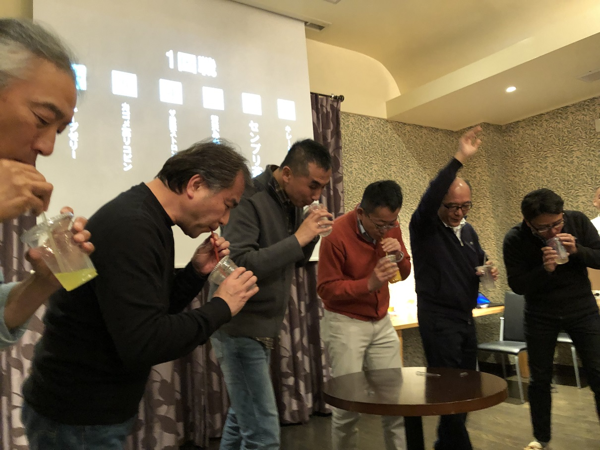

# 2018_1G1

<!DOCTYPE html>
<html>
<head>

<meta charset="UTF-8">
<meta http-equiv="Content-Type" content="text/html; charset=UTF-8">
<meta http-equiv="X-UA-Compatible" content="IE=EmulateIE10" />
<meta http-equiv="X-UA-Compatible" content="IE=edge">

<!--ここから上はお決まりの定型文です-->

<!--ここからが表現の書式などを決めるcssという部分-->

<link href="https://cdnjs.cloudflare.com/ajax/libs/lightbox2/2.7.1/css/lightbox.css" rel="stylesheet">

</head>

<body>

  モバイル端末をお使いの場合は、画面を横向きにすると
  より見やすくご覧頂けます。

    
<!--ここまでは定型文としてそのままコピペして再利用します-->
    
<h1><marquee behavior="left">!!! 2018年忘年会 !!!</marquee></h1>
    
                         
 
    
<h2>ジュース早飲み競争、豊田さん一番！</h2>

<h2>集合写真、背景と同じものです</h2>

                         
                          

<footer>
    
Copyright S.Hada 2018~2021 @MC_T_PU_PM_S (ＰＵ戦略企画課)

</footer>
    
<!--HPにさまざまなJavaScriptを呼び込むための書式-->

 
 

</body>

</html>
